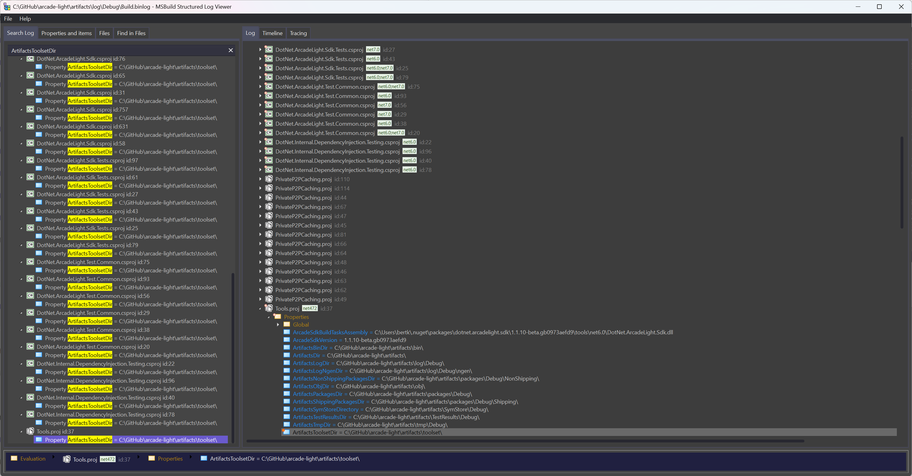

# MSBuildStructuredLog

Microsoft MSBuild log viewer tool simplifies investigations for local and CI builds.

> A logger for MSBuild that records a structured representation of executed targets, tasks, property and item values. It can greatly simplify build investigations and provides a portable log interchange format (*.binlog) and a rich interactive log viewer app.

More information:
- https://github.com/KirillOsenkov/MSBuildStructuredLog
- https://learn.microsoft.com/en-us/shows/visual-studio-toolbox/msbuild-structured-log-viewer

Download MSBuild Structured Log Viewer
- https://msbuildlog.com/

## Create binary log file

Create log file `msbuild.binlog` with MSBuild
```sh
msbuild MySolution.sln /bl
```

Create log file `artifacts\log\Debug\Build.binlog` with arcade scripts
```
build -bl
```

## Investigate log file

Search properties or analyze errors



View source files (targets and props files)


